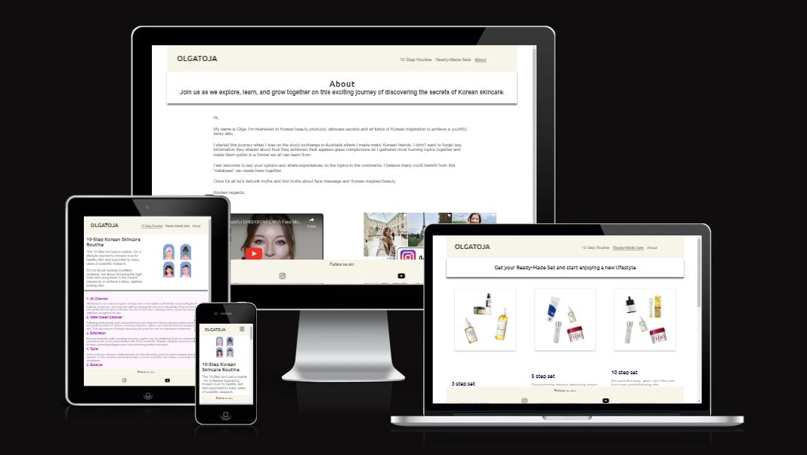
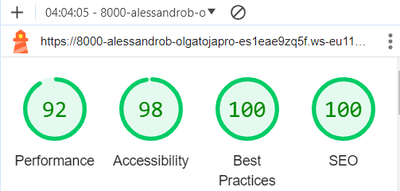

<h1 align="center">OLGATOJA Website</h1>

[View the live project here.](https://alessandro-bf.github.io/Olgatoja-Project1/)

This is the main marketing website for OLGATOJA. It is designed to be responsibe and accessible on a range of devices, making it easy to navigate for potential subscribers and customers.

<h2 align="center"></h2>

## User Experience (UX)

-   ### User stories

    -   #### First Time Visitor Goals

        1. As a First Time Visitor, I want to easily understand the main purpose of the site and learn more about the organisation.
        2. As a First Time Visitor, I want to be able to easily navigate throughout the site to find content.
        3. As a First Time Visitor, I want to get to know the organisation and locate their social media links to see their followings to determine how trusted and known they are.

    -   #### Returning Visitor Goals

        1. As a Returning Visitor, I want to find information about the lates news.
        2. As a Returning Visitor, I want to find the best way to get in contact with the organisation with any questions I may have.
        3. As a Returning Visitor, I want to find the new products they offer.

    -   #### Frequent User Goals
        1. As a Frequent User, I want to check to see if there are any newly added multi-step Korean routines.
        2. As a Frequent User, I want to check to see if there are any new products.
        3. As a Frequent User, I want to order new products.

-   ### Design
    -   #### Colour Scheme
        -   The two main colours used are OLGATOJA pink, and white.
    -   #### Typography
        -   The Ubuntu font is the main font used throughout the whole website with Sans Serif as the fallback font in case for any reason the font isn't being imported into the site correctly. Ubuntu is a clean font used frequently in programming, so it is both attractive and appropriate.
    -   #### Imagery
        -   Imagery is important. The hero image is designed to show the simplicity of the Multi-Step Korean Routine. The set images are designed to show the products and make them available to the user. The design is also minimalist, attractive, and aesthetic.

*   ### Wireframes

    -   Different versions and screen sizes - [View](https://www.figma.com/file/2Hoq3THGrdmi37lx8E0mKP/Private-projects?type=design&node-id=152-11104&mode=design&t=hiQRTHCiJyPlu5bH-0)


## Features

-   Responsive on all device sizes

-   Interactive elements

## Technologies Used

### Languages Used

-   [HTML5](https://en.wikipedia.org/wiki/HTML5)
-   [CSS3](https://en.wikipedia.org/wiki/Cascading_Style_Sheets)

### Frameworks, Libraries & Programs Used

1. [Bootstrap 4.4.1:](https://getbootstrap.com/docs/4.4/getting-started/introduction/)
    - Bootstrap was used to assist with the responsiveness and styling of the website.
1. [Hover.css:](https://ianlunn.github.io/Hover/)
    - Hover.css was used on the Social Media icons in the footer to add the float transition while being hovered over.
1. [Google Fonts:](https://fonts.google.com/)
    - Google fonts were used to import the 'Titillium Web' font into the style.css file which is used on all pages throughout the project.
1. [Font Awesome:](https://fontawesome.com/)
    - Font Awesome was used on all pages throughout the website to add icons for aesthetic and UX purposes.
1. [Git](https://git-scm.com/)
    - Git was used for version control by utilizing the Gitpod terminal to commit to Git and Push to GitHub.
1. [GitHub:](https://github.com/)
    - GitHub is used to store the projects code after being pushed from Git.
1. [Canva:](https://www.canva.com/)
    - Canva was used to create the logo, resizing images and editing photos for the website.
1. [Figma:](https://www.figma.com/)
    - Figma was used to create the [wireframes](https://www.figma.com/file/2Hoq3THGrdmi37lx8E0mKP/Private-projects?type=design&node-id=152-11104&mode=design&t=hiQRTHCiJyPlu5bH-0) during the design process.

## Testing

The W3C Markup Validator and W3C CSS Validator Services were used to validate every page of the project to ensure there were no syntax errors in the project.

-   HTML: No errors were returned when passing through the official - [W3C Markup Validator](https://jigsaw.w3.org/css-validator/#validate_by_input)
-   CSS: No errors were returned when passing through the official - [W3C CSS Validator](https://jigsaw.w3.org/css-validator/#validate_by_input)

### Testing User Stories from User Experience (UX) Section

-   #### First Time Visitor Goals

    1. As a First Time Visitor, I want to easily understand the main purpose of the site and learn more about the organisation.

        1. By entering the site, users are welcome to use a clean and easily readable navigation bar to go to the page of their choice. Underneath is a hero banner with a short description of the aim and benefits of the 10-step Korean Skincare Routine.
        2. The footer always shows the social media icons for YouTube and Instagram, where the user can learn more about the organisation.
        3. The About page introduces Olga and tells her story to engage with the users, encouraging them to go to social media to learn more.

    2. As a First Time Visitor, I want to be able to easily navigate throughout the site to find content.

        1. The site has been designed with some features to make it easy for the user to access. At the top of each page is a precise navigation bar; each link clearly describes the page they will end up at.
        2. At the footer of the three pages, there is a social media link to invite users to learn more about us.
        3. On the Ready-Made Sets Page, after a form response is submitted, the page refreshes, shows a message thanking the user for the order, and then, after 10 seconds, brings the user to the home page.

    3. As a First Time Visitor, I want to get to know the organisation and locate their social media links to see their followings to determine how trusted and known they are.

        1. Once the new visitor has read the About page and the easy steps of the Korean Routine, the user will go to the ready-made sets section and see the different products available to make the most of the routine.
        2. The user can also scroll to the bottom of any page on the site to locate social media links in the footer.
        3. At the bottom of the Ready Made Sets page, the user will find a form to order the sets with the recommended products.

-   #### Returning Visitor Goals

    1. As a Returning Visitor, I want to find information about the lates news.

        1. The social media will be showing the lates news about the routine and the results.
        2. The new products will be updated with the ready-made sets offered on the webpage.

    2. As a Returning Visitor, I want to find the best way to get in contact with the organisation with any questions I may have.

        1. The navigation bar clearly highlights the "About" Page and points to social media.

    3. As a Returning Visitor, I want to find the new products they offer.

        1. The Ready-made sets section shows the latest productos available to follow the routine acording to the goals and the results wanted for the user.
        2. Alternatively, the user can go to the social media and see the new products and how to use them.

-   #### Frequent User Goals

    1. As a Frequent User, I want to check to see if there are any newly added multi-step Korean routines.

        1. The user would already be comfortable with the website layout and can easily go to the home page and check.

    2. As a Frequent User, I want to check to see if there are any new products.

        1. The user would already be comfortable with the website layout and can easily click the social media links.

    3. As a Frequent User, I want to order new products.
        1. The user would already be comfortable with the website layout and can easily find an fill the form to place the new order.

### Further Testing

-   The Website was tested on Google Chrome, Internet Explorer, Microsoft Edge and Safari browsers.
-   The website was viewed on a variety of devices such as Desktop, Laptop, iPhone7, iPhone 8 & iPhoneX.
-   A large amount of testing was done to ensure that all pages were linking correctly.
-   Friends and family members were asked to review the site and documentation to point out any bugs and/or user experience issues.
-   A Lighthouse test was performed using the DevTool with the following results:

<h2 align="center"></h2>


### Known Bugs

-   The ready-made sets went on top of the hero banner on tablets and bigger size screens.
    -   A max-height instruction was added to the style file to avoid overflow.
-   The CSS validator was warning about sections without headings.
    -   A hidden heading was implemented to add a heading without affecting the layout.

## Deployment

### GitHub Pages

The project was deployed to GitHub Pages using the following steps...

1. Log in to GitHub and locate the [GitHub Repository](https://github.com/Alessandro-bf/Olgatoja-Project1)
2. At the top of the Repository (not top of page), locate the "Settings" Button on the menu.
3. Scroll down the Settings page until you locate the "GitHub Pages" Section.
4. Under "Source", click the dropdown called "None" and select "Master Branch".
5. The page will automatically refresh.
6. Scroll back down through the page to locate the now published site [link](https://alessandro-bf.github.io/Olgatoja-Project1/) in the "GitHub Pages" section.

### Forking the GitHub Repository
g
By forking the GitHub Repository we make a copy of the original repository on our GitHub account to view and/or make changes without affecting the original repository by using the following steps...

1. Log in to GitHub and locate the [GitHub Repository](https://github.com/Alessandro-bf/Olgatoja-Project1)
2. At the top of the Repository (not top of page) just above the "Settings" Button on the menu, locate the "Fork" Button.
3. You should now have a copy of the original repository in your GitHub account.

### Making a Local Clone

1. Log in to GitHub and locate the [GitHub Repository](https://github.com/Alessandro-bf/Olgatoja-Project1)
2. Under the repository name, click "Clone or download".
3. To clone the repository using HTTPS, under "Clone with HTTPS", copy the link.
4. Open Git Bash
5. Change the current working directory to the location where you want the cloned directory to be made.
6. Type `git clone`, and then paste the URL you copied in Step 3.

```
$ git clone https://github.com/YOUR-USERNAME/YOUR-REPOSITORY
```

7. Press Enter. Your local clone will be created.

```
$ git clone https://github.com/YOUR-USERNAME/YOUR-REPOSITORY
> Cloning into `CI-Clone`...
> remote: Counting objects: 10, done.
> remote: Compressing objects: 100% (8/8), done.
> remove: Total 10 (delta 1), reused 10 (delta 1)
> Unpacking objects: 100% (10/10), done.
```

## Credits

### Code

-   The code for the heading, footer and form was built using the Love Running project from the Full Stack Developer Course of Code Institute lessons.

-   The ReadMe.md document was produced using a model Code Institute template provided by my Mentor, Dario.

### Content

-   The website's developer and owner, Olga Drewnowska, wrote all the content.

### Media

-   The developer provided all Images with the help of the website's owner, Olga Drewnowska.

### Acknowledgements

-   My Mentor for continuous helpful feedback.

-   Tutor support at Code Institute for their support.